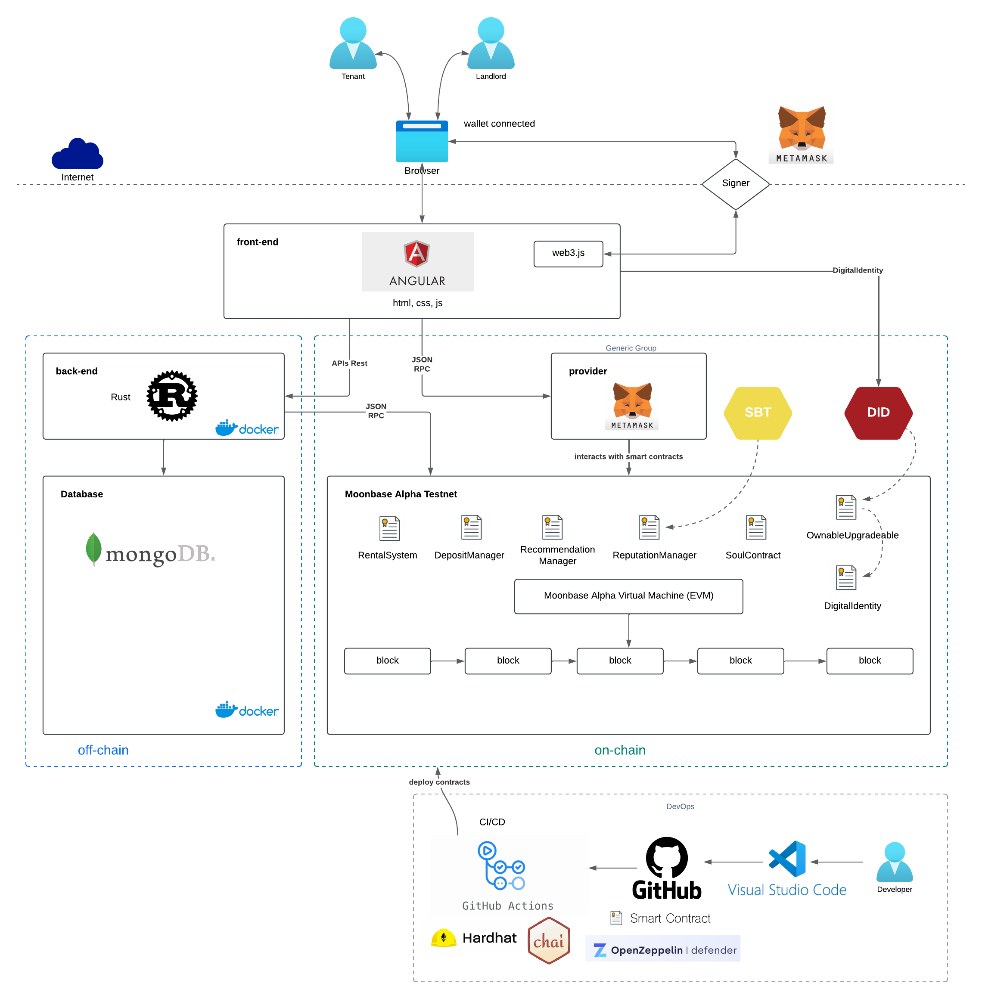
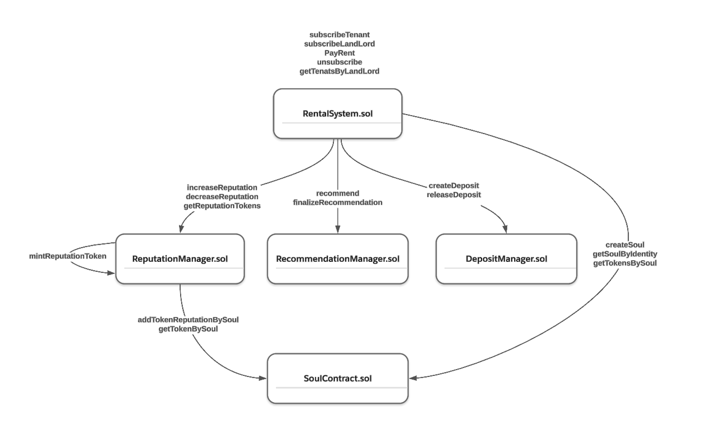
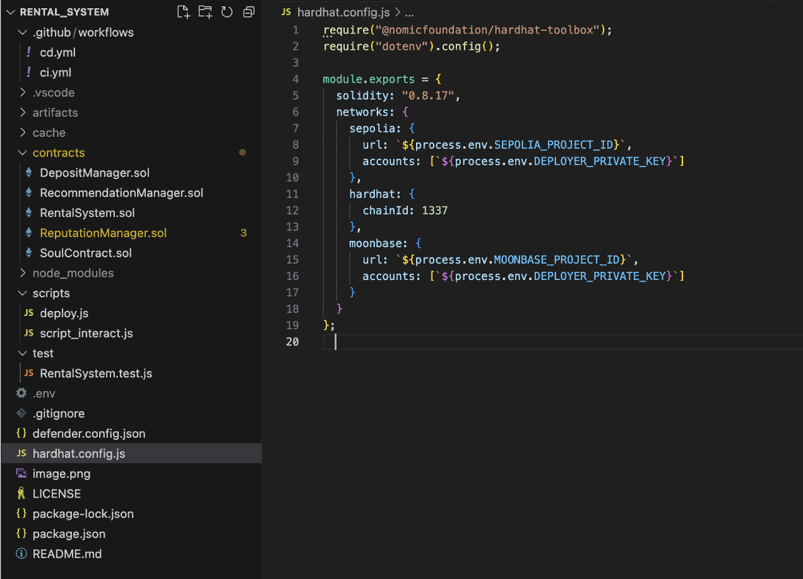
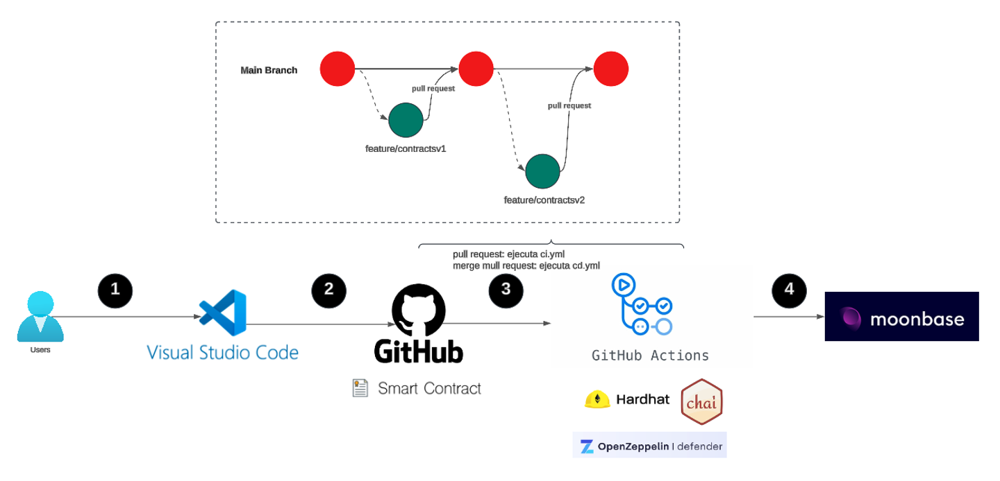

# TFM: Sistema de Reputación
El branch **main** contiene el código fuente de los contratos inteligentes que implementan la lógica central del **Sistema de Reputación**.


## Arquitectura:



## Flujo Lógico de Contratos



## Para ejecutar rental_system de forma local, sigue estos pasos:

1. Descargar el repositorio, asegúrate de que la estructura de archivos sea la siguiente:


2. Instalar **Node.js**.
Verificar la instalación con:
```shell
npm --version

```

3. Crear el archivo **.env** , con el siguiente contenido:

```shell
SEPOLIA_PROJECT_ID=https://eth-sepolia.g.alchemy.com/v2/YOUR_ALCHEMY_API_KEY
MOONBASE_PROJECT_ID=https://rpc.api.moonbase.moonbeam.network
DEPLOYER_PRIVATE_KEY=0xac09iuegdiwged872378478cbijunhygtfrde7654322ff80

```
4. Ejecutar los siguienntes comandos

```shell
npm install

# Deploy local
npx hardhat compile
npx hardhat node
npx hardhat run scripts/deploy.js --network hardhat

# Execute Test Cases
npx hardhat test

# Deploy desde local a las redes como Sepolia o Moonbase
# Deploy sepolia
npx hardhat run scripts/deploy.js --network sepolia
# Deploy Moonbase
npx hardhat run scripts/deploy.js --network moonbase
```

## Despliegue Automatizado

Para realizar un incremento, crean una rama **feature** desde **main**. Realizar los cambios necesarios y crear un pull request a main.

Esto permitirá integrar los nuevos cambios de manera controlada al branch principal **main**.



